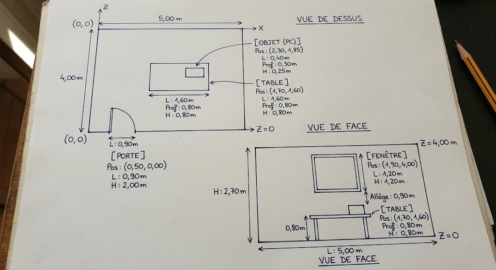

# c1-exo10 : Le plan de votre salle

## Réponse

Plan dessiné sur papier, vue de dessus et vue de face :

Toutes les dimensions sont en mètres. L'origine (0, 0) est le coin en bas à gauche de la vue de dessus : x va vers la droite, le long du mur de la porte, et z va vers le mur du fond. La position donnée est celle du coin de l'élément le plus proche de l'origine.

| Élément | Largeur (m) | Profondeur (m) | Hauteur (m) | Position (x, z) du coin (m) |
|---|---|---|---|---|
| Salle | 5,00 | 4,00 | 2,70 | (0,00 ; 0,00) |
| Porte | 0,90 | non indiquée | 2,00 | (0,50 ; 0,00), sur le mur z = 0 |
| Fenêtre | 1,20 | non indiquée | 1,20, allège à 0,90 | (1,90 ; 4,00), sur le mur du fond |
| Table | 1,60 | 0,80 | 0,80 | (1,70 ; 1,60) |
| Objet sur la table (PC) | 0,40 | 0,30 | 0,25 | (2,30 ; 1,85), posé sur la table |
